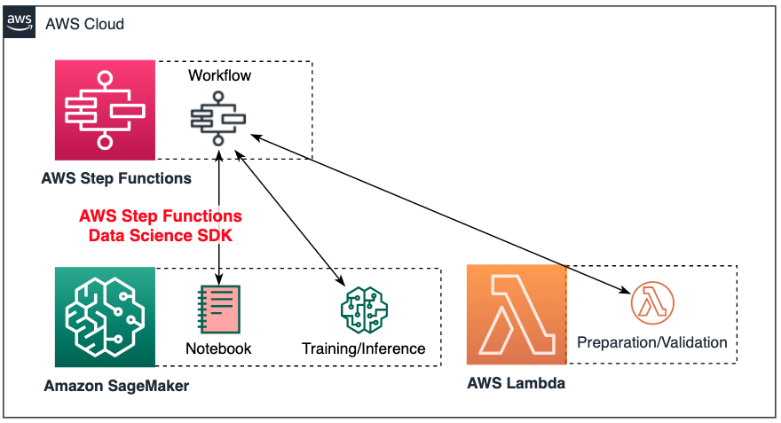

## **Build end-to-end ML/AI workflows with the AWS Step Functions Data Science SDK**

*This repository contains the sample notebook described in this AWS Machine Learning [blog post]().*

## **Overview**

Building and deploying automated machine learning (ML) and artificial intelligence (AI) projects in production often requires provisioning and integrating a different set of functions separately for orchestrating the pipelines.

In modern cloud architectures, typically following DevOps or CI/CD practices, this means connecting the data-science and operational worlds through a set of different services for covering each step of the workflows, consuming time and effort to set up these independently on each service.

In this sample project, you will explore how you can **reduce and optimize the efforts** in these tasks by **orchestrating the infrastructure from the same place with the AWS Step Functions Data Science SDK**.

## **Instructions**

This example considers the following architecture, where the AWS Step Functions Data Science SDK allows the orchestration of the sample workflow directly from the notebook, interacting with Amazon SageMaker and some AWS Lambda functions.

  

For running this workshop you will need:
* Create an Amazon SageMaker notebook instance
* Adjust the permissions for your AWS IAM role
* Follow the steps in the sample notebook provided

### **1. Create an Amazon SageMaker notebook instance**

To create a Amazon SageMaker notebook instance:

- Open the Amazon SageMaker console for your account at https://console.aws.amazon.com/sagemaker/, or in case of AWS events follow the link provided.
- Choose "Notebook instances", then choose Create notebook instance.
- On the "Create notebook instance" page, provide the following information:
  - For Notebook instance name, type a name for your notebook instance.
  - For Notebook instance type, choose "ml.t3.medium" unless told otherwise.
  - For IAM role, choose "Create a new role". Amazon SageMaker creates an IAM role named "AmazonSageMaker-ExecutionRole-YYYYMMDDTHHmmSS". The AWS managed policy AmazonSageMakerFullAccess is attached to the role. The role provides permissions that allow the notebook instance to call Amazon SageMaker and Amazon S3. Note the name of this role, as you will need to attach additional permissions to it later.
  - For Git repositories, choose "Clone a public Git repository to this notebook instance only", then add the URL: https://github.com/rodzanto/ml-pipelines-data-science-sdk
  - Finally choose "Create notebook instance".

In a few minutes, Amazon SageMaker launches an ML compute instance —in this case, a notebook instance— and attaches an ML storage volume to it. The notebook instance has a preconfigured Jupyter notebook server and a set of Anaconda libraries.

When the status of the notebook instance is "InService" in the console, the notebook instance is ready to use.

### 2. **Add permissions to your AWS IAM role**

- Open the AWS IAM console by choosing "IAM" in the "Services" menu.
- Choose "Roles", and search the role you created in the previous step. It should be named "AmazonSageMaker-ExecutionRole-YYYYMMDDTHHmmSS".
- Choose "Attach policies", and search for "AWSLambdaFullAccess", select the checkbox next to it and choose "Attach policy".

### 3. **Run the Data Science SDK notebook**

- Go back to the Amazon SageMaker console, choose "Notebook instances", and open the notebook you created by choosing "Open Jupyter".
- Open the sample notebook provided "amazon-sagemaker-e2e-workflows-data-science-sdk.ipynb", and follow the instructions provided in it.

## **References**

### **Citations:**

This sample project uses the Online Retail Data Set from the UCI Machine Learning Repository:

Dua, D. and Graff, C. (2019). UCI Machine Learning Repository [http://archive.ics.uci.edu/ml]. Irvine, CA: University of California, School of Information and Computer Science.

Daqing Chen, Sai Liang Sain, and Kun Guo, Data mining for the online retail industry: A case study of RFM model-based customer segmentation using data mining, Journal of Database Marketing and Customer Strategy Management, Vol. 19, No. 3, pp. 197-208, 2012 (Published online before print: 27 August 2012. doi: 10.1057/dbm.2012.17). [https://archive.ics.uci.edu/ml/datasets/Online+Retail].

### **Some Links and Documentation:**

- [AWS Step Functions Data Science Python SDK documentation](https://aws-step-functions-data-science-sdk.readthedocs.io/en/latest/index.html)
- [AWS Step Functions Data Science Python SDK GitHub repository](https://github.com/aws/aws-step-functions-data-science-sdk-python)
- [Introducing the AWS Step Functions Data Science SDK for Amazon SageMaker](https://aws.amazon.com/about-aws/whats-new/2019/11/introducing-aws-step-functions-data-science-sdk-amazon-sagemaker/?nc1=h_ls)
- [AWS Machine Learning Blog](https://aws.amazon.com/blogs/machine-learning/?nc1=h_ls)
- [AWS Machine Learning Overview](https://aws.amazon.com/machine-learning/?nc1=h_ls)

### **License**

This library is licensed under the MIT-0 License. See the LICENSE file.

